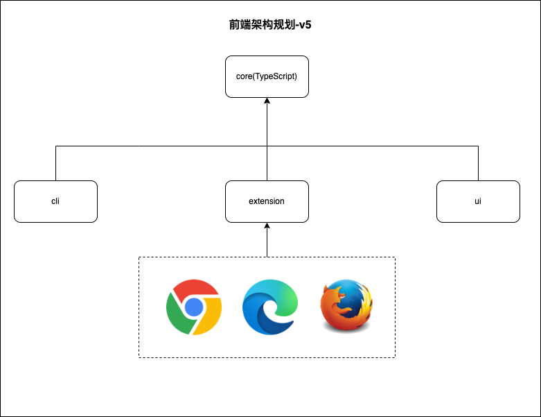

# knife4j-front

这是前端项目

- knife4j-core: 基于TypeScript编写基础核心解析包，包括对Swagger2、OpenAPI3、AsyncApi等规范的解析，并暴露解析后的数据结构，供上层应用使用
- knife4j-cli: Node生态下的cli工具，基于TypeScript编写
- knife4j-extension: 基于TypeScript编写的浏览器插件的基础包
- knife4j-extension-chrome:Chrome浏览器扩展程序
- knife4j-extension-firefox:firefox浏览器扩展程序
- knife4j-extension-edge:edge浏览器扩展程序
- knife4j-ui:基于React+Antd框架编写的前端Ui层呈现

# 架构设计

# 模块说明

## knife4j-core

前端核心模块，也是所有上层应用的基础库，基于TypeScript编写，主要作用：

一、解析适配

- 提供对当前流行的规范解析，例如：OpenAPI3、AsyncApi3、Swagger2等
- 提供对当前流行的工具格式解析，例如：Postman、curl
- 提供对Knife4j框架本身的扩展支持

二、统一数据结构

解析相应的规范、工具后，提供统一的数据结构规范，供上层应用使用

## knife4j-cli

基于Node环境下开箱即用的cli工具集合，所有可实现的IDEA都可以在该集合中进行体现，例如：

- 将OpenAPI结构的文件转换成一份美观的Markdown文档
- 本地快速开启服务端口，预览当前OpenAPI结构的文档
- more...

## knife4j-extension

该模块是各个浏览器插件的底层基础库，依赖knife4j-core模块提供的功能，主要是为上层浏览器扩展程序插件提供基础的支撑。

目前主要考虑的三个主流浏览器插件实现：chrome、firefox、edge

## knife4j-ui

基于React+Antd编写的前端ui呈现，提供文档预览、接口调试等两个核心功能