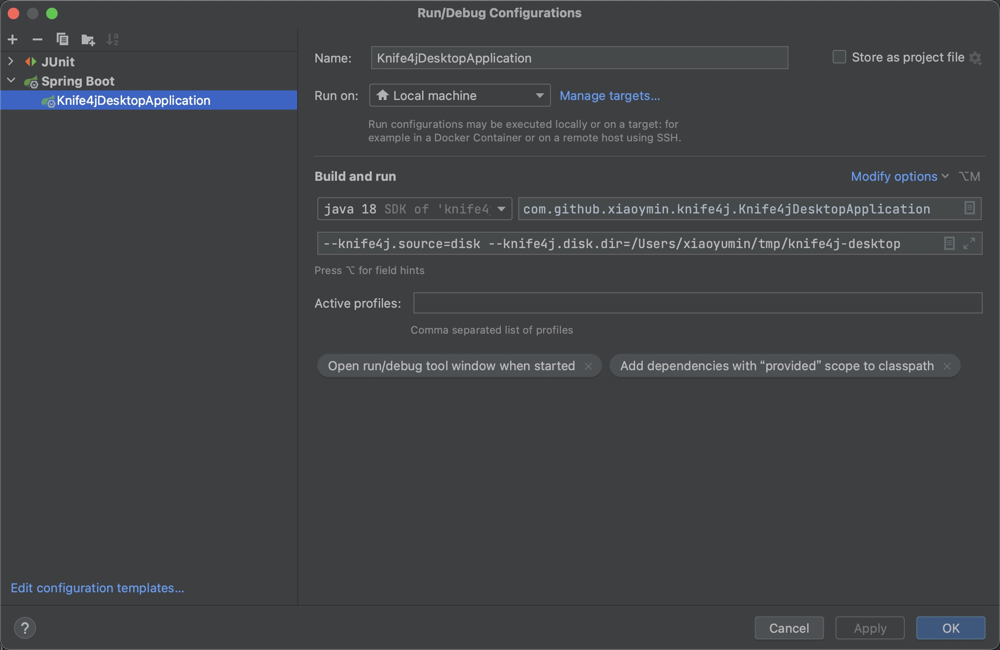

# Knife4jInsight

Knife4jInsight是一款致力于基于OpenAPI2及OpenAPI3规范进行聚合的独立中间件

在Knife4j 4.0版本发布之际，作者也对该组件进行了了架构重新设计，代码重构。

并也发布了该独立中间件的2.0版本，基于Spring Boot 3.0版本进行开发。

主要功能作用及理念：

- 独立部署(推荐使用docker-compose进行部署)
- 延续Knife4jAggregation组件在Java生态中的四种(PS:后续可以扩展更多)支持的模式
- 提供多配置中心中间件(目前暂支持Nacos)的支持，数据、功能独立分开
- 动态配置、实时生效预览
- 不同文档提供单独鉴权(该特性还待开发中...)

详细文档请参考[官方文档](https://doc.xiaominfo.com/docs/middleware-sources)

## 软件架构

软件架构图如下：


整个架构设计分层说明如下：

- 第一层(Web):对外暴露接口文档层，限定只支持一级context-path目录,context-path名称由使用者自定义，该组件理论上支持N个项目的文档聚合展示。
- 第二层(Security):提供对当前单个项目文档的鉴权，提供两种鉴权机制，一种是配置写死，另外一种可对接第三方自定义鉴权接口(需符合该组件定义的规范)
- 第三层(Gateway):基于Knife4jInsight，用户在真实调试时，基于当前流行的HttpClient、OkHttp组件库，实现从web层到真实各子服务的请求代理转发.
- 第四层(DataContext):数据层，该数据层是Knife4jInsight的数据来源,主要分两大类型：
  - 服务中心类型: 各个服务注册中心模式的解析，通过将服务中心注册的微服务进行聚合，其核心还是RESTFul API接口
  - 配置中心类型: Knife4jInsight支持的配置中心的类型，通过将数据源存放在配置中心中间件上，可以保证使用者灵活使用,目前暂支持了两种模式(本地磁盘(Disk)和Nacos)
- 第五层(Base):基础设施层,代表了当前组件所支持的规范类型(OpenAPI2+OpenAPI3),当然，后续有新的规范，在时间允许的情况下，我们都可以进行扩展支持。


## 快速开始
以开发常用Windows系统为例，基于docker-compose快速拉取Knife4j的服务镜像

```yaml
# 通过docker-compose可以快速部署knife4j服务
version: "2.0"
services:
    knife4j:
        container_name: knife4j-insight
        restart: always
        image: "xiaoymin/knife4j:v2.0"
        network_mode: "bridge"
        # 本地磁盘目录映射
        volumes:
        - D:\Temp\data:/knife4j/data
        ports:
        - "10000:10000"
        # 指定配置属性模式为disk本地磁盘
        environment:
        - knife4j.source=disk
        - knife4j.disk.dir=/knife4j/data

```


注意点：

- volumes挂载目录需要指定本地磁盘指定的目录与Knife4j容器中的目录映射，上面配置中的D:\Temp\data开发者可修改为本地任意目录
- ports端口，Knife4j容器端口默认10000
- environment为初始化环境，本次使用disk模式
- docker-compose.yml文件配置完成后，即可通过命令启动服务。

```shell
docker-compose up
```

接口在浏览器访问接口文档查看效果：http://localhost:10000/doc.html


## 源码运行


如果是Java开发者，则可以本地调试该项目，说明如下：

- 本项目基于Spring Boot 3.0版本开发
- JDK版本必须大于17
- 项目启动时，需要传递启动参数，目前主要两种模式，分别是[Disk本地磁盘](https://doc.xiaominfo.com/docs/middleware-sources/desktop/config-disk)和[Nacos](https://doc.xiaominfo.com/docs/middleware-sources/desktop/config-nacos)


Disk模式：代表当前数据文件存放到当前本地磁盘，启动参数如下：



Nacos模式：代表数据全部存放到Nacos配置中心，启动参数如下：

