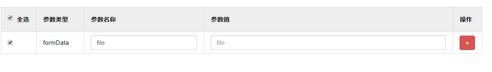

在使用SwaggerBootstrapUi的朋友经常询问的一个问题,为什么上传参数file对象不显示file文本域,而是普通文本,如下图：



因为Springfox-Swagger针对不同的版本,某些版本也会出现此问题,为一劳永逸,SwaggerBootstrapUi特别指定需要强指定dataType类型为`MultipartFile`

代码示例(**[UploadController.java](https://gitee.com/xiaoym/swagger-bootstrap-ui-demo/blob/master/swagger-bootstrap-ui-demo/src/main/java/com/swagger/bootstrap/ui/demo/controller/UploadController.java)**)：

```java
@ApiOperation(value = "文件素材上传接口")
@ApiImplicitParams({@ApiImplicitParam(name = "file[]", value = "文件流对象,接收数组格式", required = true,dataType = "MultipartFile",allowMultiple = true),
                    @ApiImplicitParam(name = "title", value = "title", required = true)}
                  )
@RequestMapping(value="/uploadMaterial",method = RequestMethod.POST)
@ResponseBody
public RestMessage uploadMaterial(@RequestParam(value="file[]",required = true) MultipartFile[] files,@RequestParam(value = "title") String title, HttpServletRequest request) throws IOException {
    //int mul=1*1024*1024;
    String realPath=request.getSession().getServletContext().getRealPath("/upload");
    File realFile=new File(realPath);
    if (!realFile.exists()){
        realFile.mkdirs();
    }
    List<Map> uploadFiles= Lists.newArrayList();
    System.out.println("进入图片上传接口:"+files.length +"张");
    for (MultipartFile file : files) {
        File targetFile=new File(realFile,file.getOriginalFilename());
        FileOutputStream fileOutputStream=null;
        InputStream ins=null;
        try{
            fileOutputStream=new FileOutputStream(targetFile);
            int i=-1;
            byte[] bytes=new byte[1024*1024];
            ins=file.getInputStream();
            while ((i=ins.read(bytes))!=-1){
                fileOutputStream.write(bytes,0,i);
            }
        }catch (IOException e){
        }finally {
            closeQuilty(ins);
            closeQuilty(fileOutputStream);
        }
        Map fileInfo= Maps.newHashMap();
        fileInfo.put("id", UUID.randomUUID().toString());
        fileInfo.put("url",targetFile.getPath());
        fileInfo.put("original_name",targetFile.getName());
        uploadFiles.add(fileInfo);
    }
    RestMessage rm=new RestMessage();
    rm.setData(uploadFiles);
    return rm;
}
```

关于多文件上传，设置allowMultiple=true即可,在UI界面端,按住Ctrl键即可多选文件.